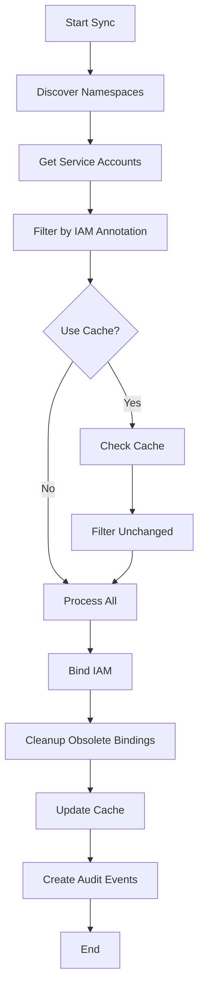

[](https://artifacthub.io/packages/search?repo=woco-io)

# cloud-iam-manager

The `cloud-iam-manager` service is designed to run within a Kubernetes cluster and facilitates the binding of Google Cloud Service Accounts (GSA) to Kubernetes Service Accounts (KSA) using a custom annotation. This service automatically identifies Kubernetes Service Accounts with specific annotations and uses the annotation value to create bindings between the GKE Service Account and the Kubernetes Service Account.

## Table of Contents

- [Features](#features)
- [Architecture](#architecture)
- [Prerequisites](#prerequisites)
- [Installation](#installation)
- [Configuration](#configuration)
- [How It Works](#how-it-works)
- [Usage Examples](#usage-examples)
- [Security Considerations](#security-considerations)
- [Monitoring and Observability](#monitoring-and-observability)
- [Performance and Scaling](#performance-and-scaling)
- [Advanced Configuration](#advanced-configuration)
- [Troubleshooting](#troubleshooting)
- [FAQ](#faq)
- [Contributing](#contributing)
- [License](#license)

## Features

- **Automatic IAM Binding**: Identifies Kubernetes Service Accounts with the specified Google Cloud Service Account annotation and creates IAM bindings automatically
- **Workload Identity Integration**: Seamless integration with GKE Workload Identity for secure access to Google Cloud resources
- **Namespace Scoping**: Configurable namespace filtering to limit operation scope
- **Intelligent Caching**: Built-in caching to avoid redundant IAM operations and improve performance
- **Cleanup Management**: Automatically removes obsolete IAM bindings when service accounts are deleted
- **Health Monitoring**: Comprehensive health checks and detailed logging for Kubernetes monitoring
- **Event Auditing**: Creates Kubernetes events for all IAM operations for audit trails
- **Configurable Polling**: Adjustable sync intervals for different operational needs

## Architecture

```
┌─────────────────────────────────────────────────────────────────────┐
│                           Kubernetes Cluster                        │
│                                                                     │
│  ┌─────────────────┐    ┌─────────────────────────────────────────┐ │
│  │   Namespace A   │    │        cloud-iam-manager              │ │
│  │                 │    │                                         │ │
│  │ ServiceAccount  │◄───┤ • Watches ServiceAccounts              │ │
│  │ + IAM annotation│    │ • Processes IAM annotations            │ │
│  └─────────────────┘    │ • Manages caching                      │ │
│                         │ • Creates audit events                 │ │
│  ┌─────────────────┐    └─────────────────────────────────────────┘ │
│  │   Namespace B   │                       │                       │
│  │                 │                       │                       │
│  │ ServiceAccount  │◄──────────────────────┘                       │
│  │ + IAM annotation│                                               │
│  └─────────────────┘                                               │
└─────────────────────────────────────────────────────────────────────┘
                              │
                              ▼
                    ┌─────────────────────┐
                    │   Google Cloud IAM  │
                    │                     │
                    │ • Service Accounts  │
                    │ • IAM Bindings      │
                    │ • Workload Identity │
                    └─────────────────────┘
```

### Key Components

- **ServiceAccountsFacade**: Main orchestration service that coordinates the entire workflow
- **K8sServiceAccountService**: Manages Kubernetes service account operations and events
- **K8sNamespaceService**: Handles namespace discovery and filtering
- **CloudServiceIam**: Manages cloud provider IAM operations (GCP implementation)
- **Caching Layer**: Optimizes performance by tracking processed service accounts
- **Health Indicators**: Monitors service and Kubernetes client health

## Prerequisites

Before deploying the service, ensure the following are available:

1. **Kubernetes Cluster**: A running Kubernetes cluster (GKE recommended for Workload Identity)
2. **Workload Identity**: GKE Workload Identity enabled on the cluster
3. **Helm**: Helm 3.x installed and configured to deploy charts to the cluster
4. **Docker**: Docker installed for building custom images (if needed)
5. **Google Cloud Project**: A GCP project with the necessary IAM permissions
6. **Service Account Permissions**: The service requires specific IAM roles (see [Security Considerations](#security-considerations))

## Installation

### 1. Clone the Repository

Clone this repository to your local machine:

```bash
git clone https://github.com/woco-io/cloud-iam-manager.git
cd cloud-iam-manager
```

### 2. Build the Docker Image (Optional)

If you need to build a custom image:

```bash
docker build -t cloud-iam-manager:latest .
```

### 3. Deploy Using Helm

Deploy the `cloud-iam-manager` service to your Kubernetes cluster:

```bash
# Add the Helm repository (if published)
helm repo add woco-io https://charts.woco.io
helm repo update

# Install with default values
helm install cloud-iam-manager woco-io/cloud-iam-manager

# Or install from local chart
helm install cloud-iam-manager ./helm/chart
```

### 4. Verify Installation

Check that the service is running:

```bash
kubectl get pods -l app=cloud-iam-manager
kubectl logs -l app=cloud-iam-manager
```

## Configuration

The service can be configured using the `application.yaml` file or through environment variables. Here are the main configuration settings:

### Application Configuration

```yaml
server:
  port: ${APP_SERVER_PORT:5000}

app-conf:
  health:
    liveness:
      k8s-client:
        include: ${APP_HEALTH_LIVE_INCLUDE_K8S_CLIENT:true}
  runners:
    polling-interval: ${APP_RUNNERS_POLLING_INTERVAL:10000}
  k8s-config:
    namespace-label: ${APP_CLOUD_IAM_MANAGER_NS_LABEL:cloud-iam-manager.woco.io/enabled=true}
    eventTimingMinusHours: ${APP_CLOUD_IAM_MANAGER_EVENT_TIMING_MINUS_HOURS:0}
    service-account-iam-annotation: ${APP_CLOUD_IAM_MANAGER_SA_IAM_ANNOTATION:iam.gke.io/gcp-service-account}
  cloud-config:
    cloud-provider: ${APP_CLOUD_IAM_MANAGER_CLOUD_PROVIDER:GCP}
    iam-binding-role: ${APP_CLOUD_IAM_MANAGER_IAM_BINDING_ROLE:iam.workloadIdentityUser}
    project-id: ${APP_GCP_PROJECT_ID}
    is-preserve-iam-bindings: ${APP_CLOUD_IAM_MANAGER_IS_PRESERVE_IAM_BINDINGS:true}
  global:
    is-use-cache: ${APP_IS_USE_CACHE:true}
```

### Environment Variables

| Environment Variable                             | Description                                                                                             | Default Value                            |
|--------------------------------------------------|---------------------------------------------------------------------------------------------------------|------------------------------------------|
| `APP_SERVER_PORT`                                | Port on which the service will run.                                                                     | `5000`                                   |
| `APP_HEALTH_LIVE_INCLUDE_K8S_CLIENT`             | Include custom Kubernetes client liveness checks.                                                       | `true`                                   |
| `APP_RUNNERS_POLLING_INTERVAL`                   | Polling runner interval (milliseconds).                                                                 | `10000`                                  |
| `APP_CLOUD_IAM_MANAGER_NS_LABEL`                 | Label used to filter Kubernetes namespaces for the service to operate in, use "all" for all namespaces. | `cloud-iam-manager.woco.io/enabled=true` |
| `APP_CLOUD_IAM_MANAGER_EVENT_TIMING_MINUS_HOURS` | Adjust event timing (in hours) for the service.                                                         | `0`                                      |
| `APP_CLOUD_IAM_MANAGER_SA_IAM_ANNOTATION`        | Annotation key used to identify the Kubernetes Service Accounts to bind.                                | `iam.gke.io/gcp-service-account`         |
| `APP_CLOUD_IAM_MANAGER_CLOUD_PROVIDER`           | The cloud provider (supports GCP).                                                                      | `GCP`                                    |
| `APP_CLOUD_IAM_MANAGER_IAM_BINDING_ROLE`         | IAM role used when binding the Google Service Account to the Kubernetes Service Account.                | `iam.workloadIdentityUser`               |
| `APP_GCP_PROJECT_ID`                             | Google Cloud Project ID to be used for the GSA binding.                                                 | **Required**                             |
| `APP_CLOUD_IAM_MANAGER_IS_PRESERVE_IAM_BINDINGS` | Whether to preserve existing IAM bindings when adding new ones.                                         | `true`                                   |
| `APP_IS_USE_CACHE`                               | Whether to enable cache usage for performance optimization.                                             | `true`                                   |

## How It Works

### Workflow Overview

1. **Namespace Discovery**: The service scans for Kubernetes namespaces matching the configured label selector
2. **Service Account Detection**: Within target namespaces, it identifies Service Accounts with the IAM annotation
3. **Caching Optimization**: Uses intelligent caching to skip unchanged service accounts
4. **IAM Binding**: Creates Workload Identity bindings between KSA and GSA
5. **Cleanup Management**: Removes obsolete IAM bindings for deleted service accounts
6. **Event Auditing**: Creates Kubernetes events for all operations

### Detailed Process



## Usage Examples

### Basic Service Account

Create a Kubernetes Service Account with the required annotation:

```yaml
apiVersion: v1
kind: ServiceAccount
metadata:
  name: my-app-sa
  namespace: production
  annotations:
    iam.gke.io/gcp-service-account: "my-app@my-project.iam.gserviceaccount.com"
```

### Deployment with Service Account

Use the service account in your deployment:

```yaml
apiVersion: apps/v1
kind: Deployment
metadata:
  name: my-app
  namespace: production
spec:
  replicas: 3
  selector:
    matchLabels:
      app: my-app
  template:
    metadata:
      labels:
        app: my-app
    spec:
      serviceAccountName: my-app-sa
      containers:
      - name: my-app
        image: my-app:latest
        # Your application will now have access to GCP resources
        # based on the permissions of my-app@my-project.iam.gserviceaccount.com
```

### Namespace Configuration

Enable the cloud-iam-manager for a namespace:

```yaml
apiVersion: v1
kind: Namespace
metadata:
  name: production
  labels:
    cloud-iam-manager.woco.io/enabled: "true"
```

## Security Considerations

### Required IAM Permissions

The cloud-iam-manager service account needs the following GCP IAM roles:

```yaml
# Minimal required permissions
roles/iam.serviceAccountAdmin        # To manage service account IAM bindings
roles/iam.workloadIdentityUser      # To create workload identity bindings

# Additional permissions for enhanced functionality
roles/monitoring.metricWriter       # For metrics export (optional)
roles/logging.logWriter            # For centralized logging (optional)
```

### Kubernetes RBAC

The service requires these Kubernetes permissions:

```yaml
apiVersion: rbac.authorization.k8s.io/v1
kind: ClusterRole
metadata:
  name: cloud-iam-manager
rules:
- apiGroups: [""]
  resources: ["serviceaccounts", "namespaces", "events"]
  verbs: ["get", "list", "watch", "create", "update", "patch"]
```

### Security Best Practices

1. **Principle of Least Privilege**: Only grant necessary permissions
2. **Namespace Isolation**: Use namespace labels to limit scope
3. **Audit Logging**: Enable audit logs for all IAM operations
4. **Regular Review**: Periodically review IAM bindings and permissions
5. **Network Security**: Use network policies to restrict service communication

## Monitoring and Observability

### Health Endpoints

The service exposes several health endpoints:

```bash
# Liveness probe
curl http://localhost:5000/actuator/health/liveness

# Readiness probe
curl http://localhost:5000/actuator/health/readiness

# Full health check
curl http://localhost:5000/actuator/health
```

### Metrics and Logging

Monitor these key metrics:

- **Sync Duration**: Time taken for each sync cycle
- **Service Account Count**: Number of service accounts processed
- **IAM Binding Success/Failure Rate**: Success rate of IAM operations
- **Cache Hit Rate**: Effectiveness of caching

Example Prometheus queries:

```promql
# Sync duration
histogram_quantile(0.95, cloud_iam_manager_sync_duration_seconds)

# Error rate
rate(cloud_iam_manager_errors_total[5m])

# Cache effectiveness
cloud_iam_manager_cache_hit_rate
```

### Kubernetes Events

The service creates events for important operations:

```bash
# View events for a specific service account
kubectl get events --field-selector involvedObject.name=my-app-sa

# View all cloud-iam-manager events
kubectl get events --field-selector reason="Bind IAM"
```

## Performance and Scaling

### Performance Tuning

1. **Polling Interval**: Adjust based on your change frequency
   ```yaml
   APP_RUNNERS_POLLING_INTERVAL: "30000"  # 30 seconds for less frequent changes
   ```

2. **Caching**: Enable caching for better performance
   ```yaml
   APP_IS_USE_CACHE: "true"
   ```

3. **Namespace Filtering**: Limit scope to improve performance
   ```yaml
   APP_CLOUD_IAM_MANAGER_NS_LABEL: "team=platform"
   ```

### Scaling Considerations

- **Single Instance**: The service is designed to run as a single instance
- **Leader Election**: Future versions may support leader election for HA
- **Resource Limits**: Set appropriate CPU/memory limits based on cluster size

## Advanced Configuration

### Custom Annotations

You can customize the annotation key:

```yaml
APP_CLOUD_IAM_MANAGER_SA_IAM_ANNOTATION: "custom.domain/gcp-service-account"
```

### Multiple Projects

For multi-project setups, deploy separate instances:

```bash
# Project A
helm install cloud-iam-manager-proj-a ./helm/chart \
  --set config.gcpProjectId="project-a"

# Project B  
helm install cloud-iam-manager-proj-b ./helm/chart \
  --set config.gcpProjectId="project-b"
```

### Development Mode

For development environments:

```yaml
# Disable caching for immediate updates
APP_IS_USE_CACHE: "false"

# Increase polling frequency
APP_RUNNERS_POLLING_INTERVAL: "5000"

# Enable debug logging
APP_LOG_LEVEL: "DEBUG"
```

## Troubleshooting

### Common Issues

#### 1. Service Account Not Being Processed

**Symptoms**: Service account has annotation but no IAM binding is created

**Solutions**:
- Check if namespace has the required label
- Verify annotation key matches configuration
- Check service logs for errors

```bash
kubectl logs -l app=cloud-iam-manager | grep "my-app-sa"
```

#### 2. Permission Denied Errors

**Symptoms**: IAM binding fails with permission errors

**Solutions**:
- Verify the cloud-iam-manager service account has required IAM roles
- Check if the target GSA exists
- Ensure Workload Identity is enabled on the cluster

#### 3. High Memory Usage

**Symptoms**: Service consuming excessive memory

**Solutions**:
- Enable caching to reduce API calls
- Increase polling interval
- Add memory limits to the deployment

### Debug Commands

```bash
# Check service health
kubectl get pods -l app=cloud-iam-manager
kubectl describe pod -l app=cloud-iam-manager

# View detailed logs
kubectl logs -l app=cloud-iam-manager --previous

# Check RBAC permissions
kubectl auth can-i list serviceaccounts --as=system:serviceaccount:default:cloud-iam-manager

# Verify IAM bindings (using gcloud)
gcloud iam service-accounts get-iam-policy my-app@my-project.iam.gserviceaccount.com
```

## FAQ

### Q: Can I use this with multiple GCP projects?
A: Yes, deploy separate instances of the service, each configured for a different project.

### Q: What happens when a Kubernetes service account is deleted?
A: The service automatically removes the corresponding IAM binding during the next sync cycle.

### Q: Can I disable caching?
A: Yes, set `APP_IS_USE_CACHE=false`, but this may impact performance with many service accounts.

### Q: How often does the service sync?
A: By default every 10 seconds, configurable via `APP_RUNNERS_POLLING_INTERVAL`.

### Q: Is this compatible with Istio?
A: Yes, the service works with Istio service mesh without additional configuration.

### Q: Can I monitor the service with Prometheus?
A: Yes, the service exposes metrics that can be scraped by Prometheus.

## Contributing

We welcome contributions! Please see our contributing guidelines:

1. **Fork** the repository
2. **Create** a feature branch (`git checkout -b feature/amazing-feature`)
3. **Commit** your changes (`git commit -m 'Add amazing feature'`)
4. **Push** to the branch (`git push origin feature/amazing-feature`)
5. **Open** a Pull Request

### Development Setup

```bash
# Clone and setup
git clone https://github.com/woco-io/cloud-iam-manager.git
cd cloud-iam-manager

# Build locally
./mvnw clean package

# Run tests
./mvnw test

# Build Docker image
docker build -t cloud-iam-manager:dev .
```

### Code Style

- Follow Java coding conventions
- Add comprehensive comments for complex logic
- Include unit tests for new features
- Update documentation for configuration changes

## License

This project is licensed under the MIT License - see the [LICENSE](LICENSE) file for details.

---

**Maintainers**: [woco-io](https://github.com/woco-io)  
**Issues**: [GitHub Issues](https://github.com/woco-io/cloud-iam-manager/issues)  
**Documentation**: [Wiki](https://github.com/woco-io/cloud-iam-manager/wiki)
